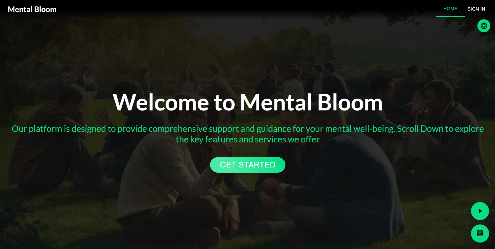

# Mental Bloom

**Mental Bloom** is a comprehensive digital mental health assistance platform designed to provide accessible, personalized, and secure mental health support to users, specifically tailored to the Sri Lankan context. By leveraging a microservices architecture, the platform delivers features like mood tracking, educational resources, support forums, therapist access, and crisis intervention tools.

---

## Features

### Key Features
- **Mood Tracking**: Log, analyze, and visualize your mood patterns over time.
- **Personalized Recommendations**: AI-driven suggestions tailored to user needs and behavior.
- **Educational Resources**: Access to articles, videos, and tools to improve mental health awareness.
- **Community Forums**: Engage in discussions and connect with others facing similar challenges.
- **Therapist Consultations**: Schedule therapy sessions with licensed professionals.
- **Crisis Intervention**: Immediate help and resources for mental health emergencies.
- **Notifications**: Get reminders for mood logging, appointments, and recommendations.
- **MultiLanguage Support**: Can access in three languages Sinhala Tamil and English. 

---

## Microservices Overview

  

The application follows a microservices architecture where each service operates independently, communicating via RESTful APIs or asynchronous messaging. Here is a list of the services and their functionalities:

### 1. **User Management Service**
- Handles user registration, authentication, and profile management.
- Ensures privacy through role-based access and secure data handling.

### 2. **Mood Tracking Service**
- Allows users to log moods and add contextual notes.
- Analyzes mood data and provides visualizations (graphs, trends).
- Publishes data to the Recommendation Engine for further analysis.

### 3. **Recommendation Engine**
- Uses AI/ML algorithms to generate personalized suggestions based on user behavior.
- Provides mental health tips, activities, and content suggestions.

### 4. **Content Management Service**
- Manages a library of educational resources (articles, videos, and tools).
- Supports advanced search and filtering functionalities.

### 5. **Forum Service**
- Enables community engagement through moderated forums.
- Allows users to ask questions, share experiences, and interact with peers.

### 6. **Therapist Management Service**
- Lists licensed therapists and their availability.
- Manages appointment booking and supports video consultations.

### 7. **Crisis Intervention Service**
- Provides access to emergency hotlines and resources.
- Integrates with third-party crisis management systems.

### 8. **Notification Service**
- Sends real-time reminders and alerts to users.
- Subscribes to message queues for event-driven notifications.

---

## Technical Details

### Architecture
- **Microservices Architecture**: Independent services with dedicated responsibilities.
- **Technology Stack**:
  - **Frontend**: React.js for web, React Native for mobile.
  - **Backend**: Node.js, Python (AI/ML services).
  - **Database**: MongoDB with support for vector search.
  - **AI/ML**: TensorFlow, PyTorch for model development.

### Deployment
- **Containerization**: Docker for packaging microservices.
- **Orchestration**: Kubernetes for scaling and load balancing.
- **Cloud Hosting**: Deployed on AWS/GCP for high availability and scalability.
- **CI/CD**: GitHub Actions for automated testing and deployment.

### Security
- **Authentication**: OAuth 2.0 and JWT tokens.
- **Data Protection**: End-to-end encryption (TLS), compliance with GDPR and Sri Lanka’s data protection laws.

---
